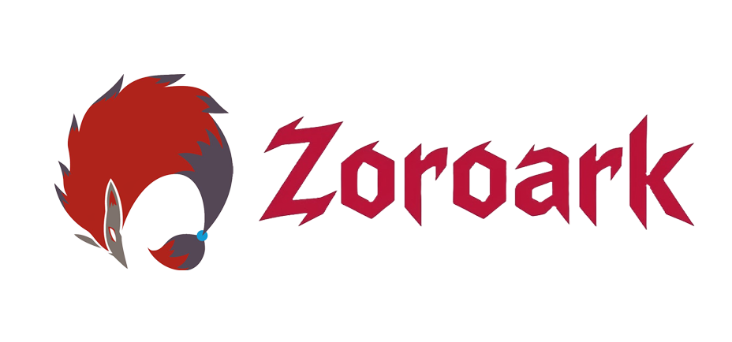

<div align="center">
  
</div>

<div align="center">

[](https://www.python.org/)
[](https://github.com/jlowin/fastmcp)
[](https://github.com/unclecode/crawl4ai)
[](LICENSE)

*A blazing-fast MCP server that finds and fetches documentation for any package — on demand.*

</div>

---

## Overview

**MCP Docs Server** is a [Model Context Protocol](https://modelcontextprotocol.io/) server that gives AI assistants real-time access to up-to-date documentation. It exposes two tools:

| Tool | Description |
|---|---|
| `resolve_docs` | Searches DuckDuckGo + npm/PyPI to find the best documentation URLs for a package |
| `scrape_page` | Fetches a URL and returns its content as clean markdown |

Feed it a package name from any question, get back the right docs — no stale snapshots, no hallucinated APIs.

---

## How It Works

```
User question
     │
     ▼
resolve_docs(package_name, keywords?, version?)
     │  DuckDuckGo search  +  npm / PyPI registry lookup
     ▼
List of ranked documentation URLs
     │
     ▼
scrape_page(url)
     │  Crawl4AI headless browser → clean markdown
     ▼
Documentation content returned to the AI
```

---

## Installation

> Requires **Python 3.12+** and [uv](https://github.com/astral-sh/uv).

```bash
# Clone the repository
git clone https://github.com/your-username/mcp-docs-server.git
cd mcp-docs-server

# Install dependencies
uv sync
```

After first use, run the Crawl4AI post-install setup (downloads browser binaries):

```bash
uv run crawl4ai-setup
```

---

## Usage

### stdio (default — for AI clients like Claude Desktop)

```bash
uv run python -m mcp_docs_server.main
```

### HTTP transport

```bash
MCP_TRANSPORT=http MCP_PORT=8000 uv run python -m mcp_docs_server.main
```

---

## Claude Desktop Configuration

Add the following to your `claude_desktop_config.json`:

```json
{
  "mcpServers": {
    "docs-server": {
      "command": "uv",
      "args": [
        "--directory", "/absolute/path/to/mcp-docs-server",
        "run", "python", "-m", "mcp_docs_server.main"
      ]
    }
  }
}
```

---

## Tools Reference

### `resolve_docs`

Find documentation URLs for a package.

| Parameter | Type | Required | Description |
|---|---|---|---|
| `package_name` | `str` | ✅ | Exact package name as on npm or PyPI (e.g. `"react"`, `"fastapi"`) |
| `keywords` | `list[str]` | ❌ | 2–5 specific technical terms from the user's question |
| `version` | `str` | ❌ | Specific version string (e.g. `"18"`, `"4.0"`) |

Returns up to 6 results — top 5 from DuckDuckGo in ranked order, plus the official registry link if not already present.

---

### `scrape_page`

Scrape a documentation page and return its content as markdown.

| Parameter | Type | Required | Description |
|---|---|---|---|
| `url` | `str` | ✅ | Full URL to fetch (typically from `resolve_docs`) |

Returns a dict with `url` and `content` (markdown text, capped at 300 000 chars).

---

## Configuration

Settings are read from environment variables (or a `.env` file):

| Variable | Default | Description |
|---|---|---|
| `RESOLVER_TIMEOUT` | `5` | HTTP timeout (seconds) for URL resolution |
| `HEURISTIC_TIMEOUT` | `3` | Timeout for registry heuristic checks |
| `SCRAPER_TIMEOUT_MS` | `20000` | Page load timeout for the headless browser (ms) |
| `SCRAPER_MAX_CONTENT_CHARS` | `300000` | Maximum characters returned from a scraped page |
| `MCP_TRANSPORT` | `stdio` | Transport mode: `stdio` or `http` |
| `MCP_PORT` | `8000` | Port used when `MCP_TRANSPORT=http` |

---

## Project Structure

```
mcp-docs-server/
├── src/
│   ├── media/
│   │   ├── logo.png               # Repository logo
│   │   └── logo_with_text.png     # Logo with tool name
│   └── mcp_docs_server/
│       ├── main.py                # FastMCP server & tool definitions
│       ├── config.py              # Pydantic settings
│       └── pipeline/
│           ├── resolver.py        # Stage 1 — URL resolution
│           └── scraper.py         # Stage 2 — page scraping
├── pyproject.toml
└── README.md
```

---

## License

MIT — see [LICENSE](LICENSE) for details.
